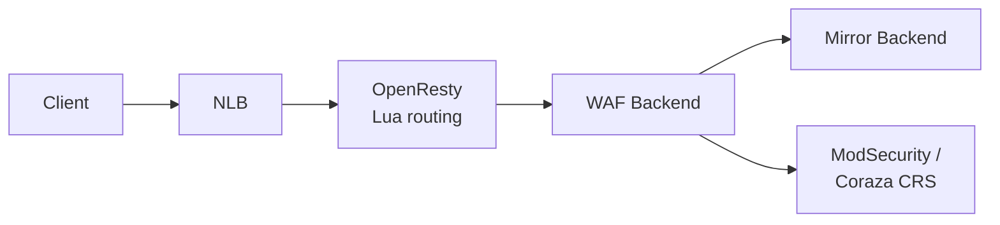

{}
The CRS Sandbox is a shared public resource. Please review the [CRS Sandbox Security Policy]({}) before use.
{}

## Introducing the CRS Sandbox

We have set up a public **CRS Sandbox** which you can use to send attacks at the CRS. You can choose between various WAF engines and CRS versions. The sandbox parses audit logs and returns our detections in an easy and useful format.

The sandbox is useful for:

- integrators and administrators: you can test out our response in case of an urgent security event, such as the Log4j vulnerability;
- exploit developers/researchers: if you have devised a payload, you can test beforehand if it will be blocked by the CRS and by which versions;
- CRS developers/rule writers: you can quickly check if the CRS catches a (variant of an) exploit without the hassle of setting up your own CRS instance.

## Quick reference


{}
**Header:** `x-backend`

| Value | Engine |
|-------|--------|
| `apache` (default) | Apache 2 + ModSecurity 2.9 |
| `nginx` | Nginx + ModSecurity 3 |
| `coraza` | Coraza WAF on Caddy |

```bash
curl -H "x-backend: coraza" \
  -H "x-format-output: txt-matched-rules" \
  'https://sandbox.coreruleset.org/?file=/etc/passwd'
```
{}
{}
**Header:** `x-crs-version`

| Value | Description |
|-------|-------------|
| `latest` (default) | Latest release |
| `3.3.9`, `4.x.x`, ... | Specific semver version |

```bash
curl -H "x-crs-version: 3.3.9" \
  -H "x-format-output: txt-matched-rules" \
  'https://sandbox.coreruleset.org/?file=/etc/passwd'
```
{}
{}
**Header:** `x-crs-paranoia-level`

| Value | Description |
|-------|-------------|
| `1` (default) | Least strict |
| `2` | Moderate |
| `3` | Strict |
| `4` | Most strict |

```bash
curl -H "x-crs-paranoia-level: 3" \
  -H "x-format-output: txt-matched-rules" \
  'https://sandbox.coreruleset.org/?file=/etc/passwd'
```
{}
{}
**Header:** `x-crs-mode`

| Value | Description |
|-------|-------------|
| `On` (default) | Blocking mode |
| `detection` | Detection only |

**Header:** `x-crs-inbound-anomaly-score-threshold` (default: `5`)

**Header:** `x-crs-outbound-anomaly-score-threshold` (default: `4`)

```bash
curl -H "x-crs-mode: detection" \
  -H "x-crs-inbound-anomaly-score-threshold: 10" \
  -H "x-format-output: txt-matched-rules" \
  'https://sandbox.coreruleset.org/?file=/etc/passwd'
```
{}
{}
**Header:** `x-format-output`

| Value | Description |
|-------|-------------|
| _(omitted)_ | Full audit log as JSON |
| `txt-matched-rules` | Human-readable matched rules |
| `txt-matched-rules-extended` | Extended text with explanation |
| `json-matched-rules` | JSON formatted |
| `csv-matched-rules` | CSV formatted |
| `html-matched-rules` | HTML table |

```bash
curl -H "x-format-output: json-matched-rules" \
  'https://sandbox.coreruleset.org/?file=/etc/passwd' | jq .
```
{}
{}
**Apache** with text output and CRS 4.x:

```bash
curl -H "x-backend: apache" \
  -H "x-crs-version: 4.25.0" \
  -H "x-format-output: txt-matched-rules" \
  'https://sandbox.coreruleset.org/?file=/etc/passwd'
```

**Nginx** with JSON output and CRS 3.3.9:

```bash
curl -H "x-backend: nginx" \
  -H "x-crs-version: 3.3.9" \
  -H "x-format-output: json-matched-rules" \
  'https://sandbox.coreruleset.org/?q=<script>alert(1)</script>' | jq .
```

**Coraza** with extended text output and latest CRS:

```bash
curl -H "x-backend: coraza" \
  -H "x-crs-version: latest" \
  -H "x-format-output: txt-matched-rules-extended" \
  'https://sandbox.coreruleset.org/?cmd=cat+/etc/shadow'
```
{}


## Basic usage

The sandbox is located at https://sandbox.coreruleset.org/.

An easy way to use the sandbox is to send requests to it with `curl`, although you can use any HTTPS client.

The sandbox has many options, which you can change by adding HTTP headers to your request. One is very important so we will explain it first; this is the `X-Format-Output: txt-matched-rules` header. If you add this header to your request, the sandbox will parse the WAF's output, and return to you the matched CRS rule IDs with descriptions, and the score for your request.

### Example

```bash
curl -H "x-format-output: txt-matched-rules" https://sandbox.coreruleset.org/?file=/etc/passwd

930120 PL1 OS File Access Attempt
932160 PL1 Remote Command Execution: Unix Shell Code Found
949110 PL1 Inbound Anomaly Score Exceeded (Total Score: 10)
980130 PL1 Inbound Anomaly Score Exceeded (Total Inbound Score: 10 - SQLI=0,XSS=0,RFI=0,LFI=5,RCE=5,PHPI=0,HTTP=0,SESS=0): individual paranoia level scores: 10, 0, 0, 0
```

In this example, we sent `?file=/etc/passwd` as a GET payload. The CRS should catch the string `/etc/passwd` which is on our blocklist. Try out the command in a terminal now if you like!

You can send anything you want at the sandbox, for instance, you can send HTTP headers, POST data, use various HTTP methods, et cetera.

If no attack is detected, the sandbox returns an empty result in the requested format (e.g., an empty JSON array `[]` for `json-matched-rules`, or an empty response for `txt-matched-rules`).

The sandbox also adds a `X-Unique-Id` header to the response. It contains a unique value that you can use to refer to your request when communicating with us. With `curl -i` you can see the returned headers.

### Example showing the response headers

```bash
curl -i -H 'x-format-output: txt-matched-rules' \
  'https://sandbox.coreruleset.org/?test=posix_uname()'
HTTP/1.1 200 OK
Date: Tue, 25 Jan 2022 13:53:07 GMT
Content-Type: text/plain
Transfer-Encoding: chunked
Connection: keep-alive
X-Unique-ID: YfAAw3Gq8uf24wZCMjHTcAAAANE
x-backend: apache-latest

933150 PL1 PHP Injection Attack: High-Risk PHP Function Name Found
949110 PL1 Inbound Anomaly Score Exceeded (Total Score: 5)
980130 PL1 Inbound Anomaly Score Exceeded (Total Inbound Score: 5 - SQLI=0,XSS=0,RFI=0,LFI=0,RCE=0,PHPI=5,HTTP=0,SESS=0): individual paranoia level scores: 5, 0, 0, 0
```

## Default options

It's useful to know that you can tweak the sandbox in various ways. If you don't send any `X-` headers, the sandbox will use the following defaults.

- The default backend is _Apache 2 with ModSecurity 2.9_.
- The default CRS version is the _latest release version_.
- The default Paranoia Level is 1, which is the least strict setting.
- By default, the response is the full audit log from the WAF, which is verbose and includes unnecessary information, hence why `X-Format-Output: txt-matched-rules` is useful.

## Changing options

Let's say you want to try your payload on different WAF engines or CRS versions, or like the output in a different format for automated usage. You can do this by adding the following HTTP headers to your request:

- `x-crs-version`: will pick another CRS version. Available values are `latest` (default, currently the latest release) and any supported semver version (e.g. `3.3.9`).
- `x-crs-paranoia-level`: will run CRS in a given paranoia level. Available values are `1` (default), `2`, `3`, `4`.
- `x-crs-mode`: can be changed to return the http status code from the backend WAF. Default value is blocking (`On`), and can be changed using `detection` (will set engine to `DetectionOnly`). Values are case insensitive.
- `x-crs-inbound-anomaly-score-threshold`: defines the inbound anomaly score threshold. Valid values are any integer > 0, with `5` being the CRS default. ⚠️ Anything different than a positive integer will be taken as 0, so it will be ignored. This only makes sense if `blocking` mode is enabled (the default now).
- `x-crs-outbound-anomaly-score-threshold`: defines the outbound anomaly score threshold. Valid values are any integer > 0, with `4` being the CRS default.  ⚠️ Anything different than a positive integer will be taken as 0, so it will be ignored. This only makes sense if `blocking` mode is enabled (the default now).
- `x-backend` allows you to select the specific backend web server:
  - `apache` (default) will send the request to **Apache 2 + ModSecurity 2.9**.
  - `nginx` will send the request to **Nginx + ModSecurity 3**.
  - `coraza` will send the request to **Coraza WAF on Caddy**.
- `x-format-output` formats the response to your use-case (human or automation). Available values are:
  -  omitted/default: the WAF's audit log is returned unmodified as JSON
  - `txt-matched-rules`: human-readable list of CRS rule matches, one rule per line
  - `txt-matched-rules-extended`: same but with explanation for easy inclusion in publications
  - `json-matched-rules`: JSON formatted CRS rule matches
  - `csv-matched-rules`: CSV formatted
  - `html-matched-rules`: HTML page with a styled table of matched rules

Invalid `x-format-output` values default to `json-matched-rules`.

The header names are case-insensitive.

{}
If you work with JSON output (either unmodified or matched rules), `jq` is a useful tool to work with the output, for example you can add `| jq .` to get a pretty-printed JSON, or use `jq` to filter and modify the output.
{}

### Advanced examples

Let's say you want to send a payload to CRS version **3.3.9** and choose **Nginx + ModSecurity 3** as a backend, because this is what you are interested in. You want to get the output in JSON because you want to process the results with a script. (For now, we use `jq` to pretty-print it.)

The command would look like:

```bash
curl -H "x-backend: nginx" \
  -H "x-crs-version: 3.3.9" \
  -H "x-format-output: json-matched-rules" \
  https://sandbox.coreruleset.org/?file=/etc/passwd | jq .

[
  {
    "message": "OS File Access Attempt",
    "id": "930120",
    "paranoia_level": "1"
  },
  {
    "message": "Remote Command Execution: Unix Shell Code Found",
    "id": "932160",
    "paranoia_level": "1"
  },
  {
    "message": "Inbound Anomaly Score Exceeded (Total Score: 10)",
    "id": "949110",
    "paranoia_level": "1"
  }
]
```

You can also test the same payload across different WAF engines to compare detection behavior:

```bash
# Test on Coraza (Caddy-based WAF)
curl -H "x-backend: coraza" \
  -H "x-format-output: txt-matched-rules" \
  'https://sandbox.coreruleset.org/?q=<script>alert(1)</script>'
```

Let's say you are working on a vulnerability publication and want to add a paragraph to explain how CRS protects (or doesn't!) against your exploit. Then the `txt-matched-rules-extended` can be a useful format for you.

```bash
curl -H 'x-format-output: txt-matched-rules-extended' \
  https://sandbox.coreruleset.org/?file=/etc/passwd

This payload has been tested against the OWASP CRS
web application firewall. The test was executed using the apache engine and CRS version latest.

The payload is being detected by triggering the following rules:

930120 PL1 OS File Access Attempt
932160 PL1 Remote Command Execution: Unix Shell Code Found
949110 PL1 Inbound Anomaly Score Exceeded (Total Score: 10)
980130 PL1 Inbound Anomaly Score Exceeded (Total Inbound Score: 10 - SQLI=0,XSS=0,RFI=0,LFI=5,RCE=5,PHPI=0,HTTP=0,SESS=0): individual paranoia level scores: 10, 0, 0, 0

CRS therefore detects this payload starting with paranoia level 1.
```

## Capacity

- Please do not send more than 10 requests per second.
- We will try to scale in response to demand.

## Data and privacy

All requests sent to the sandbox are logged and processed by the sandbox infrastructure. **Do not send real personal data, credentials, API keys, or any sensitive information** in your requests. By using the sandbox, you acknowledge that submitted request content may be retained and analyzed by the OWASP CRS Team for the purpose of improving CRS rules and sandbox infrastructure. See the [CRS Sandbox Security Policy]({}) for full details.

## Architecture

The sandbox consists of various parts. An NLB (Network Load Balancer) sits in front of the frontend and distributes incoming traffic. The frontend that receives the requests runs on OpenResty (Nginx with Lua). It handles the incoming request, selects and configures the backend running CRS based on the request headers, proxies the request to the backend, and waits for the response. Then it parses the WAF audit log and sends the matched rules back in the format chosen by the user.



There is a backend container for every engine and version. The current backends are:

| Backend | Engine | Container |
|---------|--------|-----------|
| Apache + ModSecurity 2.9 | `apache` | `apache-latest`, `apache-3_3_8` |
| Nginx + ModSecurity 3 | `nginx` | `nginx-latest`, `nginx-3_3_8` |
| Coraza WAF on Caddy | `coraza` | `coraza-latest` |

The backend writes their JSON audit logs to a shared volume. OpenResty reads the per-transaction audit log file to extract matched rules and format the response. Logs are also collected by Filebeat and sent to an S3 bucket and Elasticsearch for monitoring.

## Known issues

In some cases, the sandbox will not properly handle and finish your request.

- **Malformed HTTP requests:** The frontend, OpenResty, is itself a HTTP server which performs parsing of the incoming request. The backend servers running CRS are regular webservers such as Apache and Nginx. Either one of these may reject a malformed HTTP request with an error 400 before it is even processed by CRS. This happens for instance when you try to send an Apache 2.4.50 attack that depended on a URL encoding violation. If you receive an error 400, your request was rejected by the frontend or a backend, and it was not scanned by CRS.
- **ReDoS:** If your request leads to a ReDoS and makes the backend spend too much time to process a regular expression, this leads to a timeout from the backend server. The frontend will cancel the request with an error 502. If you have to wait a long time and then receive an error 502, there was likely a ReDoS situation.

## Questions and suggestions

If you have any issues with the CRS sandbox, please open a GitHub issue at [https://github.com/coreruleset/coreruleset/issues](https://github.com/coreruleset/coreruleset/issues) and we will help you as soon as possible.

If you have suggestions for extra functionality, a GitHub issue is appreciated.
